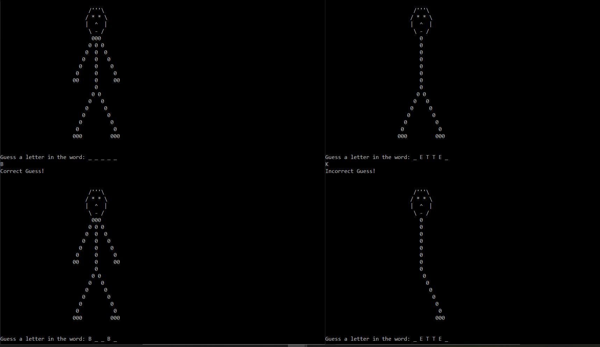

# Hang-Man

Hang-Man game built using python. It is a console based game. In the game of Hangman, a clue word is given by the
program that the player has to guess, letter by letter. Let’s say the word the player has to guess is “EVAPORATE”. A player is asked to guess a letter and displays letters in the clue word that were guessed
correctly. The letters which player guessed are saved and displayed a different message if the
player tries to guess that letter again. The user can only guess 6 times and tell the user how many guesses they have left. Letters which are guessed by the user saved. If the user guesses a letter they already guessed, they are not penalized - they are let to guess again. When the player wins or loses, they are allowed to start a new game.

